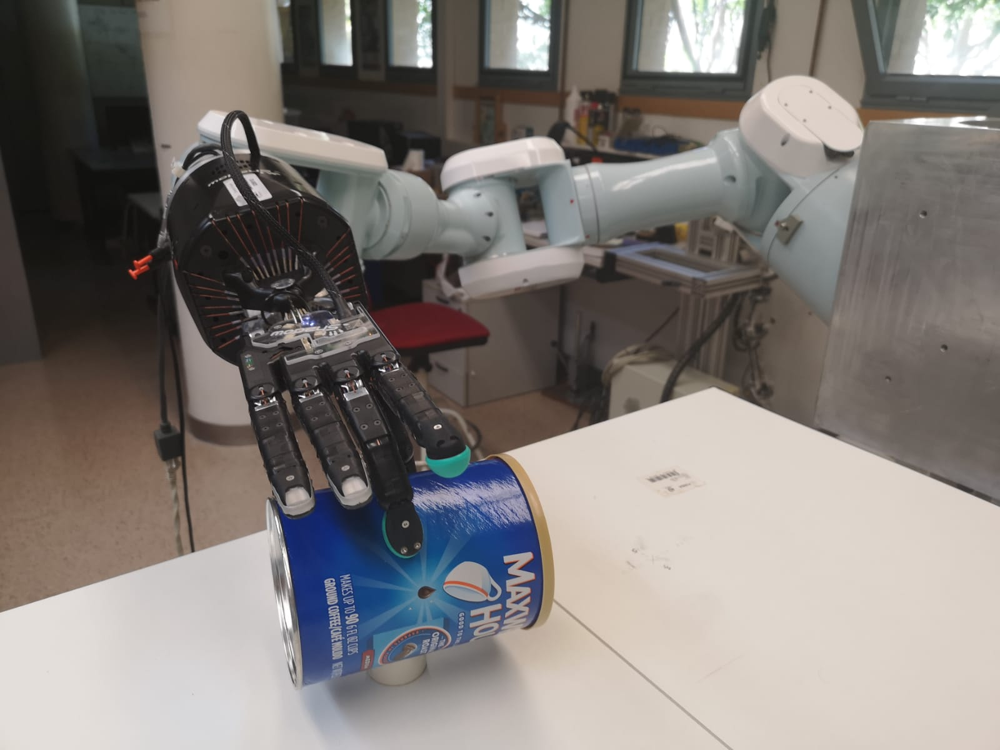
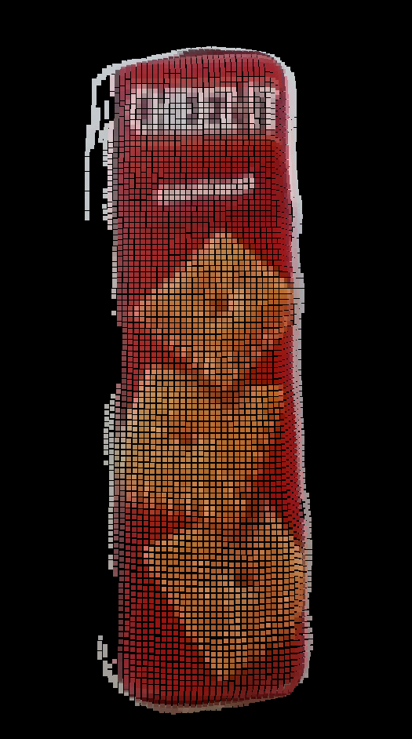
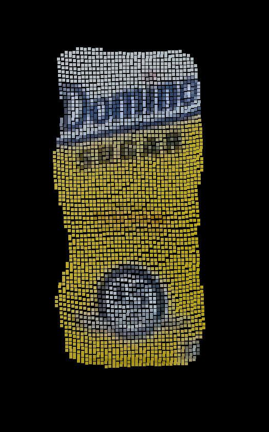
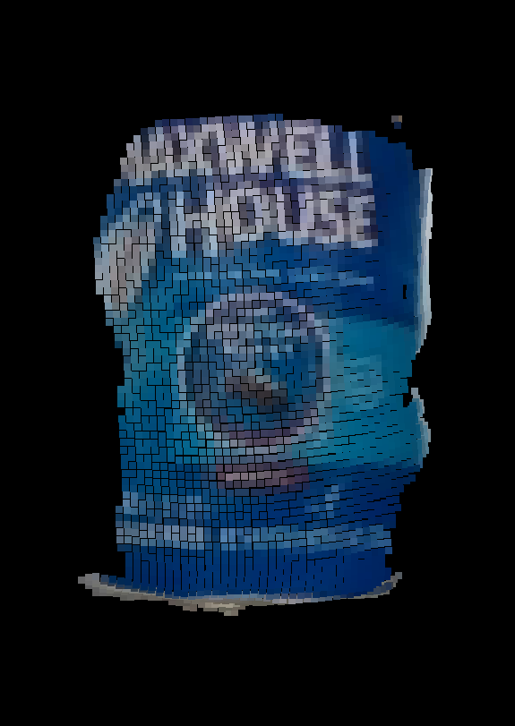
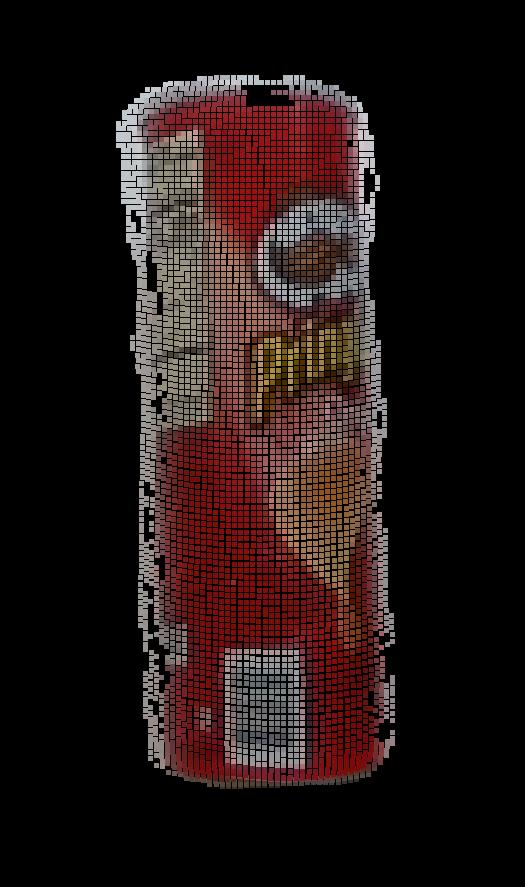

# vision2tactile: Feeling Touch by Sight

This repo holds 3D point clouds of objects that were grasped using [GeoGrasp (repo here)](https://github.com/yayaneath/GeoGrasp) and the corresponding tactile data generated by two BioTac SP tactile sensors. The sensors were installed on the middle finger and the thumb of a Shadow Dexterous hand, which was mounted on a Mitsubishi PA10 robotic arm.

There are 4 objects from the [YCB object set](http://www.ycbbenchmarks.com/): a snacks box, a coffee can, a crisps can and a sugar box. Inside of each folder, there is a unique folder for each sample. In total, we have recorded 200 real robotic grasps: there are 50 samples per object. Each sample has the following two files:

- **cloud-object.pcd:** a PCD file with the 3D point cloud of the object segmented. These point clouds were recorded using the Intel RealSense D415 camera.
- **tactile.tac:** a text file with the tactile data registered by the BioTac SP sensors. They are organised as follows: firstly, the values of the 24 electrodes of the sensor on the middle finger, followed by its PAC0, PAC1, PDC, TAC and TDC values. Secondly, these same values but for the thumb's sensor.

### Robotic setup

### Objects

 

 
